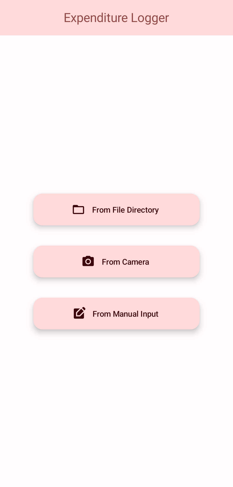
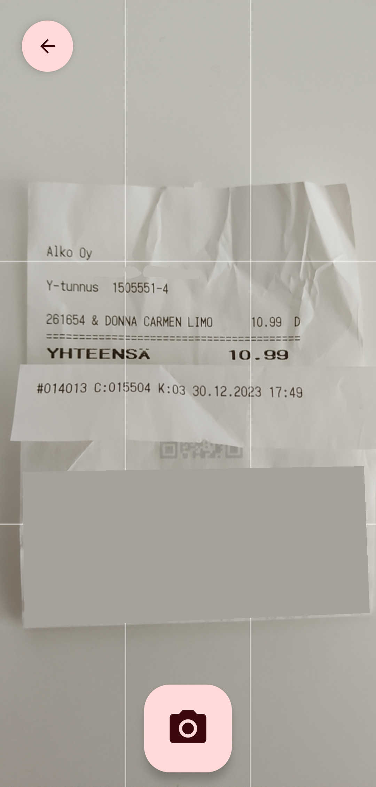
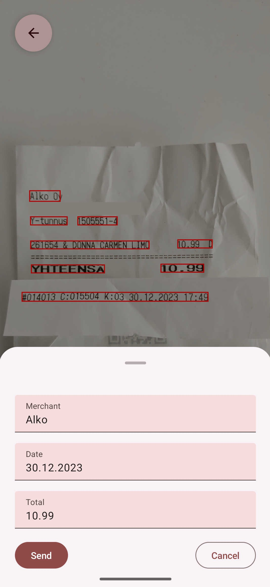

# Expenditure Logging Application

**Expenditure Logger with Receipt OCR**

Log expenditure with transactions by filling transaction information manually or with receipt OCR. Supports only Finnish.

  

## Features

### Receipt OCR

- Uses camera or image browser to get an image of a receipt
- Parses merchant name, date and total

  
  
    

### Manual input (_Not yet implemented_)

- Fill a form of transaction event manually

### Customizable list of merchant names (_Not yet implemented_)

- Create own list of merchant names to parse

### Data send (_Not yet implemented_)

- Send data to desired API endpoint
